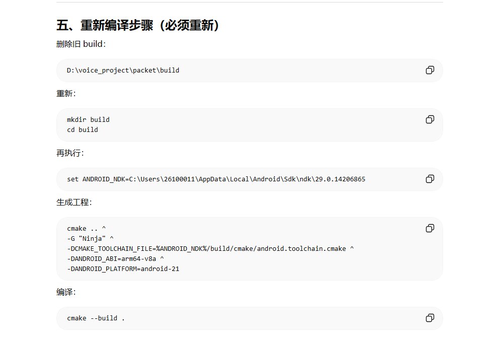
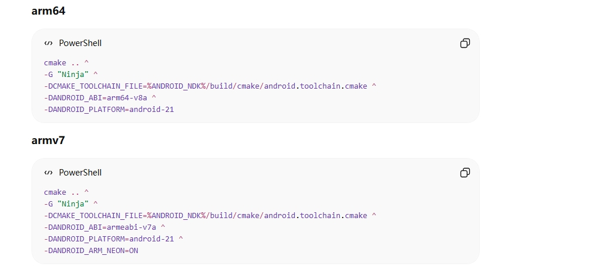

# Android NDK 构建流程文档

## 环境要求
- **操作系统**: Windows
- **工具**:
  - Android Studio
  - Android NDK (Side by side)
  - CMake
  - Ninja
- **NDK 版本**: 29.0.14206865
- **目标架构**: arm64-v8a
- **最低 API 等级**: Android 5.0 (API 21)

## 完整构建流程

### 步骤 1: 准备工作
确保已安装以下组件（通过 Android Studio SDK Manager）:
1. **NDK (Side by side)**
2. **CMake**

### 步骤 2: 配置构建环境
```bash
# 1. 进入项目根目录
cd D:\voice_project\voicechanger_sdk

# 2. 创建构建目录（如果不存在）
mkdir build_android
cd build_android
```

### 步骤 3: 生成构建文件
运行以下 CMake 命令：
```bash
cmake -G "Ninja" ^
  -DCMAKE_TOOLCHAIN_FILE="C:\Users\26100011\AppData\Local\Android\Sdk\ndk\29.0.14206865\build\cmake\android.toolchain.cmake" ^
  -DANDROID_ABI=arm64-v8a ^
  -DANDROID_PLATFORM=android-21 ^
  ..
```

**参数说明**:
- `-G "Ninja"`: 指定使用 Ninja 构建系统
- `-DCMAKE_TOOLCHAIN_FILE`: Android NDK 工具链文件路径
- `-DANDROID_ABI=arm64-v8a`: 目标架构为 64 位 ARM
- `-DANDROID_PLATFORM=android-21`: 最低 Android 版本为 5.0

### 步骤 4: 执行构建
```bash
# 在 build_android 目录中执行
cmake --build .
# 或
ninja
```

### 步骤 5: 验证构建结果
```bash
# 检查生成的库文件
dir *.so *.a
```
成功构建后应生成 `libvoicechanger.so` 文件。

## 常见问题解决

### 问题 1: 生成器冲突错误
```
CMake Error: Error: generator : Ninja
Does not match the generator used previously: Visual Studio 18 2026
```

**解决方法**:
```bash
# 完全清理构建目录
cd D:\voice_project\voicechanger_sdk
rmdir /s /q build_android
mkdir build_android
cd build_android
# 重新执行步骤 3
```

### 问题 2: 找不到 Ninja
确保使用 Android SDK 中的 Ninja:
```bash
cmake -G "Ninja" ^
  -DCMAKE_MAKE_PROGRAM="C:\Users\26100011\AppData\Local\Android\Sdk\cmake\3.22.1\bin\ninja.exe" ^
  ...其他参数...
```

## 后续构建操作

### 场景 1: 代码修改后重新构建
```bash
# 1. 进入构建目录
cd D:\voice_project\voicechanger_sdk\build_android

# 2. 重新构建（增量构建）
cmake --build .
# 或
ninja
```

### 场景 2: 清理后完整重新构建
```bash
# 1. 进入构建目录
cd D:\voice_project\voicechanger_sdk\build_android

# 2. 清理构建产物
ninja clean
# 或
cmake --build . --target clean

# 3. 重新构建
cmake --build .
```

### 场景 3: 切换不同架构构建
```bash
# 1. 返回到项目根目录
cd D:\voice_project\voicechanger_sdk

# 2. 清理旧构建
rmdir /s /q build_android
mkdir build_android
cd build_android

# 3. 构建 armeabi-v7a (32位 ARM)
cmake -G "Ninja" ^
  -DCMAKE_TOOLCHAIN_FILE="C:\Users\26100011\AppData\Local\Android\Sdk\ndk\29.0.14206865\build\cmake\android.toolchain.cmake" ^
  -DANDROID_ABI=armeabi-v7a ^
  -DANDROID_PLATFORM=android-21 ^
  ..

# 4. 执行构建
cmake --build .
```

### 场景 4: 构建多个架构
```bash
# 创建不同的构建目录
cd D:\voice_project\voicechanger_sdk

# arm64-v8a
mkdir build_android_arm64
cd build_android_arm64
cmake -G "Ninja" ^
  -DCMAKE_TOOLCHAIN_FILE="C:\Users\26100011\AppData\Local\Android\Sdk\ndk\29.0.14206865\build\cmake\android.toolchain.cmake" ^
  -DANDROID_ABI=arm64-v8a ^
  -DANDROID_PLATFORM=android-21 ^
  ..
cmake --build .
cd ..

# armeabi-v7a
mkdir build_android_arm32
cd build_android_arm32
cmake -G "Ninja" ^
  -DCMAKE_TOOLCHAIN_FILE="C:\Users\26100011\AppData\Local\Android\Sdk\ndk\29.0.14206865\build\cmake\android.toolchain.cmake" ^
  -DANDROID_ABI=armeabi-v7a ^
  -DANDROID_PLATFORM=android-21 ^
  ..
cmake --build .
```

## 实用脚本

### 快速构建脚本 (`build_android.bat`)
```batch
@echo off
echo ===== Android NDK 构建脚本 =====
echo.

set PROJECT_DIR=D:\voice_project\voicechanger_sdk
set NDK_PATH=C:\Users\26100011\AppData\Local\Android\Sdk\ndk\29.0.14206865
set BUILD_DIR=%PROJECT_DIR%\build_android
set ABI=arm64-v8a
set PLATFORM=android-21

echo 1. 清理旧构建...
if exist "%BUILD_DIR%" (
    echo 删除 %BUILD_DIR%...
    rmdir /s /q "%BUILD_DIR%"
)

echo.
echo 2. 创建构建目录...
mkdir "%BUILD_DIR%"
cd /d "%BUILD_DIR%"

echo.
echo 3. 配置 CMake...
echo NDK路径: %NDK_PATH%
echo 目标架构: %ABI%
echo 目标平台: %PLATFORM%
echo.

cmake -G "Ninja" ^
  -DCMAKE_TOOLCHAIN_FILE="%NDK_PATH%\build\cmake\android.toolchain.cmake" ^
  -DANDROID_ABI=%ABI% ^
  -DANDROID_PLATFORM=%PLATFORM% ^
  ..

if %ERRORLEVEL% NEQ 0 (
    echo CMake 配置失败!
    pause
    exit /b 1
)

echo.
echo 4. 开始构建...
cmake --build . --parallel

if %ERRORLEVEL% NEQ 0 (
    echo 构建失败!
    pause
    exit /b 1
)

echo.
echo 5. 构建完成!
dir *.so *.a
echo.
pause
```

### 多架构构建脚本 (`build_all.bat`)
```batch
@echo off
set PROJECT_DIR=D:\voice_project\voicechanger_sdk
set NDK_PATH=C:\Users\26100011\AppData\Local\Android\Sdk\ndk\29.0.14206865
set PLATFORM=android-21

for %%A in (arm64-v8a armeabi-v7a) do (
    echo ===== 构建 %%A =====
    set BUILD_DIR=%PROJECT_DIR%\build_android_%%A
    
    if exist "%BUILD_DIR%" (
        echo 清理 %%A 构建目录...
        rmdir /s /q "%BUILD_DIR%"
    )
    
    mkdir "%BUILD_DIR%"
    cd /d "%BUILD_DIR%"
    
    echo 配置 %%A...
    cmake -G "Ninja" ^
      -DCMAKE_TOOLCHAIN_FILE="%NDK_PATH%\build\cmake\android.toolchain.cmake" ^
      -DANDROID_ABI=%%A ^
      -DANDROID_PLATFORM=%PLATFORM% ^
      ..
    
    if %ERRORLEVEL% EQU 0 (
        echo 构建 %%A...
        cmake --build . --parallel
        echo %%A 构建完成!
    ) else (
        echo %%A 配置失败!
    )
    echo.
)

echo 所有架构构建完成!
pause
```

## 集成到 Android 项目

### 库文件位置
构建完成后，将生成的 `.so` 文件复制到：
```
app/src/main/jniLibs/
├── arm64-v8a/
│   └── libvoicechanger.so
└── armeabi-v7a/
    └── libvoicechanger.so
```

### 在 build.gradle 中配置
```gradle
android {
    defaultConfig {
        ndk {
            abiFilters "arm64-v8a", "armeabi-v7a"
        }
    }
}
```

---

**注意**: 如果源代码或 CMakeLists.txt 有修改，需要执行**场景 1**或**场景 2**的重新构建操作。如果修改了 CMake 配置参数，则需要执行**场景 3**的完整重新配置。




